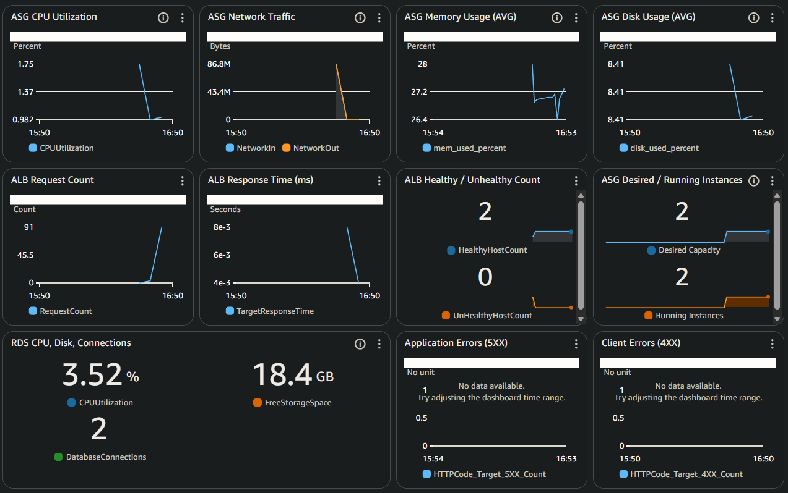
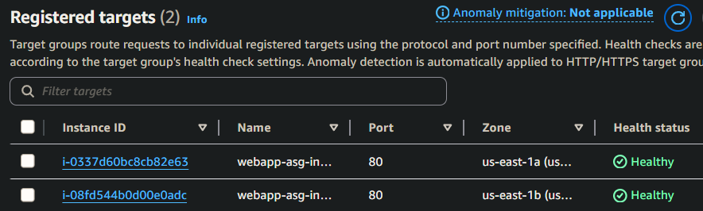
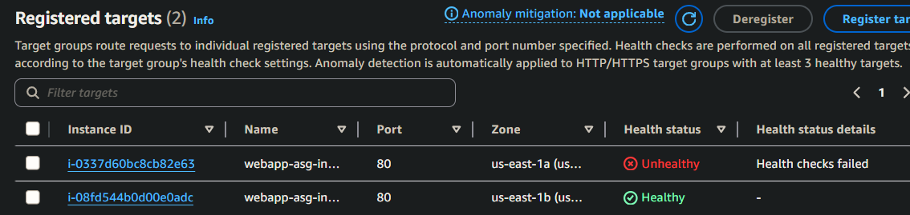
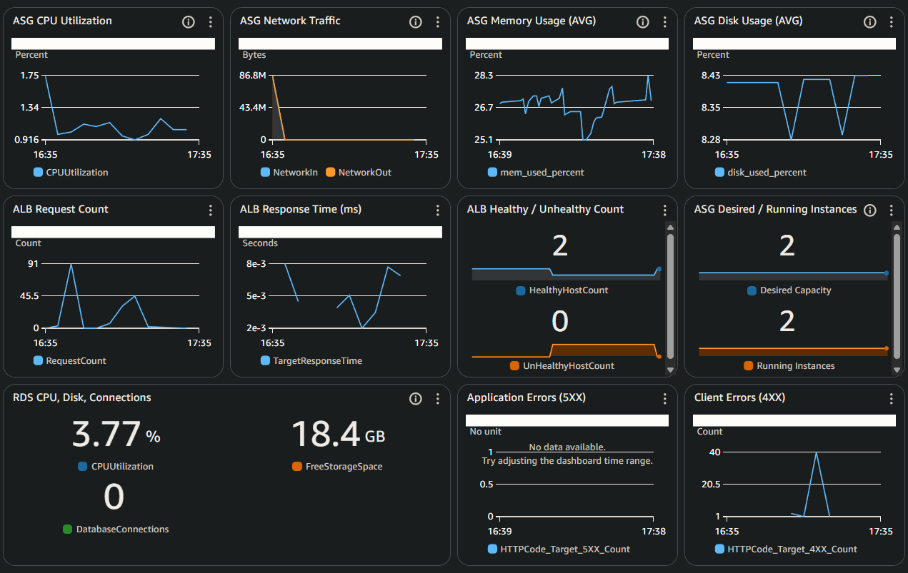
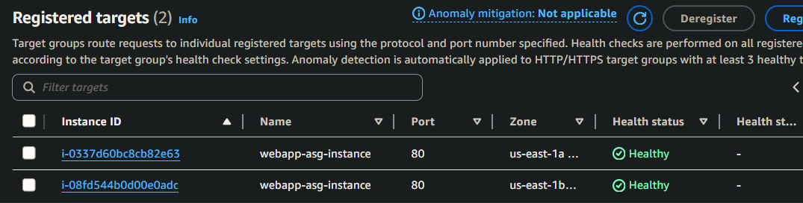

# Incident #01: Web Server Down

## Incident Summary
**Date:** 2025-11-09  
**Duration:** 22 minutes 
**Severity:** High  
**Impact:** Single instance unavailable, 50% application capacity lost  
**Root Cause:** Apache service manually stopped on i-0337d60bc8cb82e63

---

## Pre-Incident Setup

Before simulating this incident, I suspended ASG auto-healing processes to prevent automatic instance replacement during investigation. This allows time to identify root cause rather than immediately replacing the failed instance.

**Baseline system state (healthy dashboard):**


**Baseline target group health:**  


---

### Timeline

```
17:03 UTC - Manually stopped Apache on i-0337d60bc8cb82e63 to begin simulation
17:07 UTC - CloudWatch alarm triggered: `ASG-Single-Instance-Unhealthy`, received SNS email notification
17:08 UTC - Began investigation, checked instance state
17:10 UTC - SSM into instance, identified apache service stopped
17:12 UTC - Checked service logs and resource metrics
17:14 UTC - Restarted apache service, verified service running, tested application locally
17:17 UTC - Health checks passing, target group shows healthy instance
17:22 UTC - Monitored to confirm stability
17:25 UTC - Re-enabled ASG auto-healing 
```

---

## Detection

**How it was detected**

- Dashboard showed UnHealthyHostCount at 17:07 UTC
- CloudWatch alarm entered "In Alarm" state
- SNS email received
>Alarm Details:
>Name:                       ASG-Single-Instance-Unhealthy
>Description:                Reduced capacity - investigate failing instance


**Initial Observations**
- Target group: 1 healthy, 1 unhealthy
- Unhealthy instance: i-0337d60bc8cb82e63
- Instance state: running
- Status checks: 3/3 passed
- ALB health check: failing on port 80



---

## Investigation Process

Verified instance state in EC2 console:
- Instance state: running
- Status checks: 3/3 passed
- Conclusion: Instance-level infrastructure is healthy, not hardware issue


### Service Status Check

- Connected to unhealthy instance via SSM (for security best practices):
```bash
sudo systemctl status httpd
```

Output showed Apache service was inactive (dead) since Sun 2025-11-09 17:03:15 UTC;

### Root Cause Analysis

- Checked service logs to determine why Apache stopped
```bash
sudo journalctl -u httpd -n 50
```
The service was manually stopped(intentionally for the incident simulation)
Logs show:

>Nov 09 17:03:14 ip-10-0-4-185.ec2.internal systemd[1]: Stopping httpd.service - The Apache HTTP Server...
Nov 09 17:03:15 ip-10-0-4-185.ec2.internal systemd[1]: httpd.service: Deactivated successfully.
Nov 09 17:03:15 ip-10-0-4-185.ec2.internal systemd[1]: Stopped httpd.service - The Apache HTTP Server.

In a production environment, I would investigate:
- Recent deployment or config changes
- Application crashes or errors
- System resource exhaustion

```bash
# Check disk space:
df -h
# Output:
# /dev/nvme0n1p1    8.0G  1.9G  6.1G  24% /
# 8.0G total, 1.9G used (24%) - Normal


# Check memory:
free -h
# Output:
# Mem: 904Mi  238Mi  80Mi  66Mi  585Mi  463Mi
# 904Mi total, 238 Mi used, 463 Mi available - Normal


# Check running processes:
ps aux | grep httpd
# Output: ssm-user   28447  0.0  0.2 222328  2132 pts/0    S+   17:28   0:00 grep httpd
# Only the grep httpd process found, Apache (httpd) not running on instance
```

---

## Resolution

### Steps taken
```bash
# Restart Apache service
sudo systemctl start httpd

# Verify status is "active (running)"
sudo systemctl status httpd

# Make sure it starts on boot
sudo systemctl enable httpd

# Test application locally
curl localhost/index.php
```

### Verification
Waited for ALB health check cycles (30sec x 2 consecutive checks = 60sec minimum)

Results: 
- Target group health transitioning to healthy
- Instance fully healthy in target group
- Cloudwatch alarm cleared
- Monitored dashboard for 5 additional minutes - all metrics stable

**CloudWatch dashboard after recovery:**  


**Target group recovered:**  


**After resolving the incident, re-enabled ASG auto-healing processes**

---

## Lessons Learned

### What Worked Well
- Cloudwatch alarm provided immediate notification of the issue
- In a prod environment with consistent traffic the 4XX error alarm would likely  trigger as well
- Investigation ruled out instance-level problems
- Service restart was straightforward once cause was identified
- Health checks automatically detected recovery
- ASG suspension allowed time for proper investigation

### Areas For Improvement
- No proactive monitoring for service failures before health checks fail.
- Could have prioritized service-level checks earlier in investigation
- Implement systemd restart for failed processes

### Documentation Notes
- Documented investigation in real time to capture process
- In production, would document after resolution, reducing total time
- Time estimates reflect investigation and resolution, excluding documentation time

---
## Prevention Strategies 
1. **Add 4XX error alarm:** Currently monitoring 5XX errors. Adding 4XX alarm would catch connection errors when services stop.
2. **CloudWatch Agent process monitoring:** Configure Agent to monitor httpd process directly
3. **Centralized Apache logging:** Configure Apache error and access logs in CloudWatch logs. Currently see Apache messages in system logs but a dedicated log stream would provide more detail.
4. **Auto-restart capabilities:** Use systemd to auto-restart stopped processes
5. **Faster health check intervals:** Current interval is 30 seconds, could reduce for faster detection (increases costs)

---

## Technical Details

**Instance affected:** i-0337d60bc8cb82e63  
**Commands used:**
```bash
# Investigation
sudo systemctl status httpd
sudo journalctl -u httpd -n 50
df -h
free -h
ps aux | grep httpd

# Resolution
sudo systemctl start httpd
sudo systemctl enable httpd
sudo systemctl status httpd
curl localhost/index.php
```

**Metrics**
- Time to detect 3-4 minutes
- Time to identify root cause: 5 minutes
- Time to resolve: 2 minutes
- Time to verify: 9 minutes
- Total incident duration: ~20 minutes (excluding documentation)
