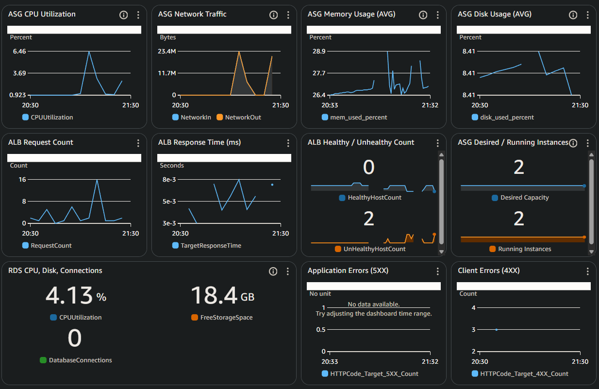
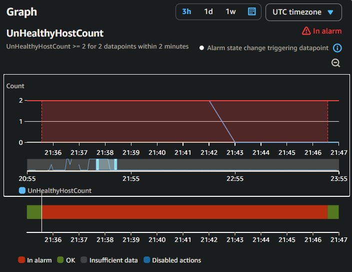
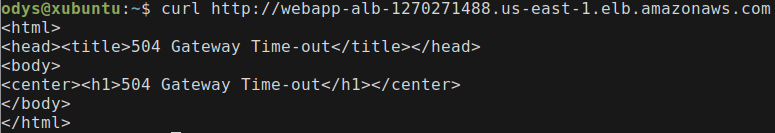
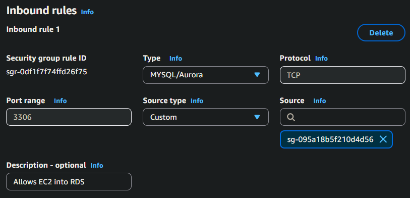
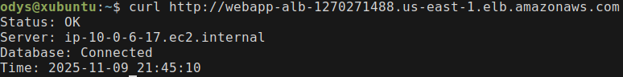

# Incident #02: Database Unreachable

## Incident Summary
**Date:** 2025-11-09  
**Duration:** 15 minutes  
**Severity:** Critical  
**Impact:** Application unable to connect to database, all instances failing health checks  
**Root Cause:** RDS security group missing inbound rule for MySQL/Aurora port 3306 from EC2 security group

---

## Pre-Incident Setup

ASG auto-healing processes remain suspended from previous incident to allow proper investigation time.

Suspended processes:
- HealthCheck
- ReplaceUnhealthy
- Terminate

---

## Timeline (in UTC)

```
21:31 - Removed RDS security group Inbound rule to begin simulation
21:33 - Dashboard showing unhealthy instances
21:35 - Both ASG-Single-Instance-Unhealthy + ASG-All-Instances-Unhealthy alarms trigger, SNS notifications received
21:37 - Verify RDS status: Available  
21:39 - SSM into instance, checked Apache logs: timeout errors found
21:40 - Test connectivity with netcat: timeout 
21:41 - Checked RDS security group: webapp-rds-sg missing MySQL/Aurora:3306 inbound rule from webapp-ec2-sg
21:42 - Add missing rule
21:43 - Verified connectivity with netcat: Connected 
21:43 - Tested MySQL connection: Successful
21:44 - Target group showing healthy instances
21:45 - Dashboard showing healthy instances
21:46 - Alarms return to OK state
```

Total duration: 15 minutes

---

## Detection

**How it was detected**

- Dashboard showed 2 Unhealthy instances


- Alarms triggered



- SNS email received:
    ```
    Alarm Details:
    Name: ASG-All-Instances-Unhealthy
    Description: Complete application outage - all targets unhealthy
    State Change: OK -> ALARM
    Reason for State Change: 
        Threshold Crossed: 2 out of the last 2 datapoints [2.0 (09/11/25 21:32:00), 2.0 (09/11/25 21:31:00)] 
        were greater than or equal to the threshold (2.0) (minimum 2 datapoints for OK -> ALARM transition)
    Timestamp: Sunday 09 November, 2025 21:35:34 UTC
    ```

**Initial Observations**
- Target group: 2/2 unhealthy
- Instance states: running
- Status checks: 3/3 passed
- Health check failing


---

## Investigation Process

### Service Status Check


- RDS state: Available

```bash
# SSM into instance and check Apache status 
sudo systemctl status httpd
# Active: active (running)

# Check apache logs 
sudo tail -50 /var/log/httpd/error_log
# apache error: [Sun Nov 09 21:32:06.172439 2025] [proxy_fcgi:error] [pid 10505:tid 10684] (70007)The timeout specified has expired: [client 10.0.18.232:3

# Attempt to connect to RDS 
nc database-cloudwatch-monitoring.c0fekuwkkx5w.us-east-1.rds.amazonaws.com 3306
# Ncat: TIMEOUT.
```



### Root Cause Analysis

Instances unable to connect to RDS. Investigated possible causes:
- Check RDS connectivity and security tab in AWS console 
- `webapp-rds-sg` missing inbound rule for MySQL/Aurora:3306 from `webapp-ec2-sg`

**Root cause identified:** Security group rule allowing EC2 instances to connect to RDS was removed.

In production environment, I would investigate:
- Network ACL and route table changes
- Who made security group modifications via CloudTrail logs

---

## Resolution

### Steps taken
- Reinstate `webapp-rds-sg rule` allowing `webapp-ec2-sg` access



### Verification

```bash
# SSM back into instance and attempt netcat
nc database-cloudwatch-monitoring.c0fekuwkkx5w.us-east-1.rds.amazonaws.com 3306
# Ncat: Connected to 10.0.12.237:3306.

# Connect directly to MySQL Db
mysql -h database-cloudwatch-monitoring.c0fekuwkkx5w.us-east-1.rds.amazonaws.com -u admin -p
# Enter password:
# Welcome to the MariaDB monitor.  Commands end with ; or \g.
# Your MySQL connection id is 463
```
- Check target group and dashboard status: All instances healthy
- Alarms return to OK state



**After resolving incident, re-enabled ASG auto-healing process**

---

## Lessons Learned

### What Worked Well
- Alarms, SNS, and dashboard provided immediate detection
- Systematic investigation: verified RDS healthy -> checked Apache logs -> tested connectivity -> found security group issue
- Apache logs clearly showed timeout, pointing to connectivity issue
- Using `nc` confirmed network-level problem before checking security groups
- Taking concise notes during investigation captured steps without slowing down

### Areas For Improvement
- Health checks detected the issue, but lack of proactive database monitoring for connectivity required investigating for the root cause
- Improve visibility into security group changes with CloudTrail logging

---

## Prevention Strategies

1. **Enable CloudTrail logging:** Track all security group changes with CloudTrail to create audit trail.
2. **AWS Config rules:** Set up Config rule to monitor security group changes on critical resources, alert when rules are modified.
3. **Tag critical security groups:** Tag production resources and implement change controls requiring approval
4. **Connectivity monitoring**: Create simple script or Lambda function to periodically test connectivity from EC2 → RDS and alert if it fails.
5. **RDS Monitoring:** Track database connection count and alert if suddenly drops to zero.
6. **Baseline documentation:** Document expected security group rules for each environment.

This incident showed the importance of network-layer monitoring and how a single missing security group rule can cause a complete outage even with all individual systems appearing healthy.

---

## Technical Details

**RDS Instance:** database-cloudwatch-monitoring.c0fekuwkkx5w.us-east-1.rds.amazonaws.com - database-cloudwatch-monitoring
**Affected Security Group:** sg-04fa8a58ad10c1481 - webapp-rds-sg  
**Commands used:**
```bash
# Investigation
sudo systemctl status httpd
sudo tail -50 /var/log/httpd/error_log
nc database-cloudwatch-monitoring.c0fekuwkkx5w.us-east-1.rds.amazonaws.com 3306
mysql -h database-cloudwatch-monitoring.c0fekuwkkx5w.us-east-1.rds.amazonaws.com -u admin -p
```

---

## Additional Notes

### Comparison to Incident #01
- **Incident #01:** Single instance failure (Apache service stopped)
- **Incident #02:** Complete outage (database connectivity blocked for all instances)
- **Lesson:** When all instances unhealthy, investigate infrastructure/network rather than individual instances

### Health Check Validation
The `healthcheck.php` created for my `aws-cloudwatch-monitoring` project a week earlier was a lightweight check that didn't test database connectivity. For this incident to work as intended I had to update the launch template with new user data testing the database connection within `healthcheck.php`

### Related Experience: User Data Debugging
During initial infrastructure setup in `aws-cloudwatch-monitoring`, I encountered a similar "all instances showing unhealthy" issue. The root cause was a missing `mariadb105` package in user data which prevented MySQL client from working.

## Incident Metrics
- Time to detect: 4 minutes
- Time to identify root cause: 5 minutes
- Time to resolve: 2 minutes
- Time to verify: 4 minutes
- Total incident duration: 15 minutes
