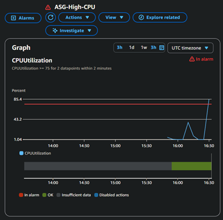
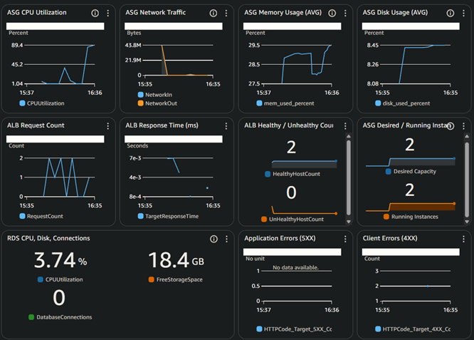
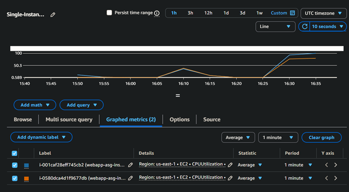
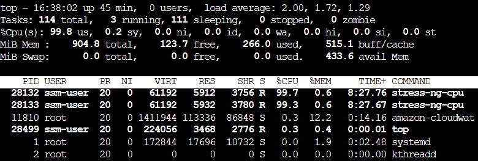
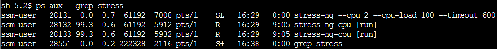
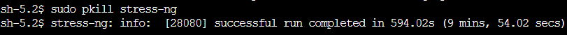
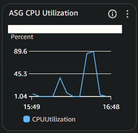
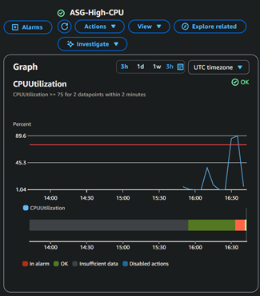
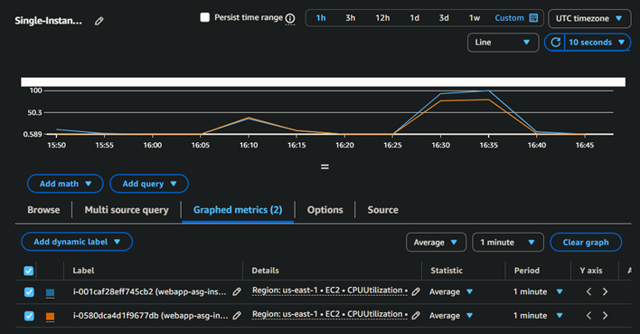

# Incident #03: High CPU Usage
## Incident Summary
**Date:** 2025-11-10  
**Duration:** 15 minutes
**Severity:** High
**Impact:** Elevated CPU utilization across Auto Scaling Group affecting application performance
**Root Cause:** High process CPU usage simulated by `stress-ng`

---

## Pre-Incident Setup

**ASG auto-healing suspended processes:** 
- HealthCheck
- ReplaceUnhealthy
- Terminate

**Monitoring configuration:**
- ASG-level CPU alarm threshold: >= 75% average
- Monitoring aggregated CPU utilization across all instances in Cloudwatch dashboard
- This incident simulates multiple instances experiencing resource contention

**Stress tool installed:**
Installed `stress-ng` on each instance to generate load for incident simulation

**Instance Bursting:** 
For the incident simulation to work correctly and allow CPUs to maintain high usage for ~10 minute period I had to change the instance's burst credit setting in the AWS CLI using: 

```bash
# Change t3.micro instance setting to allow unlimited bursting (changed for both instances)
aws ec2 modify-instance-credit-specification \
  --instance-credit-specifications InstanceId=i-0580dca4d1f9677db,CpuCredits=unlimited

# Revert back to standard when incident is complete
aws ec2 modify-instance-credit-specification \
  --instance-credit-specifications InstanceId=i-0580dca4d1f9677db,CpuCredits=standard
```

---

## Timeline

**16:30 UTC** - Initiated stress tests on both instances
**16:30 UTC** - Instance 1: stress-ng --cpu-load 100, Instance 2: stress-ng --cpu-load 80
**16:33 UTC** - Cloudwatch alarm triggered, SNS notification received
**16:34 UTC** - Check dashboard, ASG-level CPU utilization elevated
**16:35 UTC** - Analyzed per-instance metrics, identified affected instances
**16:36 UTC** - SSM to instances, found stress processes via `top`
**16:38 UTC** - Killed stress proccesses on instance 1, then instance 2 using `pkill`
**16:42 UTC** - Dashboard metrics returned to normal
**16:43 UTC** - Cloudwatch alarm returned to `OK` state

Total duration : ~15 minutes

---

## Detection

**How it was detected:**
- Cloudwatch alarm triggered- ASG-High-CPU at 16:33 UTC
- SNS email notification received
- Dashboard showed elevated CPU usage across ASG



---

## Investigation Process

### ASG-Level Analysis

Checked Auto Scaling Group CPU metrics:
- ASG Average CPU: ~85-90% (above 75% threshold)
- Alarm state: ALARM
- Both instances operational, application still responding



### Per-Instance CPU Analysis
- Checked individual instance CPU metrics in CloudWatch
- Instance breakdown:
    - Instance i-001caf28eff745cb2: ~100% CPU utilization
    - Instance i-0580dca4d1f9677db: ~80% CPU utilization

Both instances contributing to elevated ASG average, but instance 1 is primary problem.



### Process Investigation

```bash
top
ps aux | grep stress
```
Output showed:
- Multiple `stress-ng` processes consuming:
    - Instance 1: ~100% CPU each
    - Instance 2: ~80% CPU each
- Process IDs: 
    - Instance 1: 28132, 28133
    - Instance 2: 28081, 28082

Identified stress test processes as root cause

  


### Root Cause Analysis

**Root cause identified:** Stress test processes running on both instances in the auto scaling group.

In a production environment, this could represent:
- Runaway application processes
- Memory leak causing high CPU usage
- Poorly optimized code or queries
- DDoS or high traffic causing legitimate CPU spikes
- Background jobs consuming excessive resources

Would investigate:
- Recent deployments or code changes
- Application logs for errors
- Unusual traffic patterns
- Scheduled jobs or cron tasks

---

## Resolution

### Steps Taken

Terminated stress processes on both affected instances:

**Instance 1 (i-001caf28eff745cb2):**

```bash
# Kill all stress processes
sudo pkill stress-ng

# Verify termination
ps aux | grep stress
# Confirmed: Only grep process remains

# Monitor CPU recovery
top
# CPU utilization returned to normal
```

**Instance 2 (i-0580dca4d1f9677db):**
```bash
# Same procedure
sudo pkill stress-ng
ps aux | grep stress
top
# CPU returned to normal levels
```

Killed processes: `stress-ng-cpu`



### Verification

Monitored CloudWatch metrics for recovery:

**3 minutes after killing processes:**
- Instance 1 CPU: Normal
- Instance 2 CPU: Normal 
- ASG average CPU: ~7% (below 75% threshold)



**5 minutes after:**
- CloudWatch alarm transitioned to OK state
- Dashboard metrics returned to baseline levels
- Application performance normal



All systems operating normally.



---

## Post-Incident Actions

After resolving the incident:
- Re-enabled ASG auto-healing processes
- Reverted t3.micro burst credit setting from unlimited back to standard
- Verified ASG returned to normal operation and set desired to 0 to stop charges
- Confirmed burst credit charges incurred during testing period were minimal: ~.01 USD

---

## Lessons Learned

### What Worked Well
- ASG-level monitoring detected distributed resource issue effectively
- Per-instnace metrics helped identify which instances were affected
- Using `top` and `ps` commands quickly idenfitifed resource-consuming processes
- `pkill` command efficiently terminated all related processes at once
- CloudWatch alarm cleared automatically once CPU returned to normal

### Areas For Improvement
- Investigation required manual checking of individual instances
- No automatic process identification or alert for specific high-CPU processes
- Could check application logs to see if performance was impacted during high CPU

---

## Prevention Strategies

1. **Process monitoring:** Configure CloudWatch Agent to monitor top processes by CPU usage.

2. **Auto-scaling policies:** Configure ASG to scale out when CPU exceeds thresholds, distributing load across more instances.

3. **Resource limits:** Use systemd resource controls to limit CPU usage per process, preventing single processes from monopolizing resources.

4. **Alerting thresholds:** Add warning-level alarms (e.g., 60% CPU) in addition to critical alarms (75%+) for earlier detection.

5. **Process auditing:** Maintain historical record of resource-intensive processes.

---

## Technical Details

**Environment:**
- Auto Scaling Group: webapp-asg
- Affected Instances:
  - Instance 1: 100% CPU
  - Instance 2: 80% CPU
- ASG CPU Average: 89% (above alarm threshold of 75%)


**Commands:**
```bash
top                          # Monitor CPU usage in real-time
ps aux | grep stress         # Find specific processes

sudo pkill stress            # Kill all stress processes
sudo kill -9 [PID]           # Force kill specific process (alternative)

top                          # Confirm CPU recovery
ps aux | grep stress         # Verify processes terminated
```

**Alarm Details:**
- Metric: CPUUtilization (Auto Scaling Group)
- Threshold: >= 75% for 2 consecutive 1-minute periods
- Action: SNS email notification

---
## Additional Notes

### Instance Burst Credits
t3.micro instances use CPU burst credits. For this incident simulation to maintain high CPU load for the full ~10 minute duration, I temporarily enabled unlimited burst mode using AWS CLI. This prevented the instances from being throttled after exhausting burst credits.

In production, sustained high CPU on t3 instances would either:
- Exhaust burst credits and throttle to baseline performance
- Require upgrading to larger instance types or compute-optimized instances
- Trigger auto-scaling to add more instances

--- 

## Metrics
- Time to detect: 3 minutes
- Time to identify root cause: 4 minutes
- Time to resolve: 2 minutes
- Time to verify: 5 minutes
- Total incident duration: ~15 minutes

---
