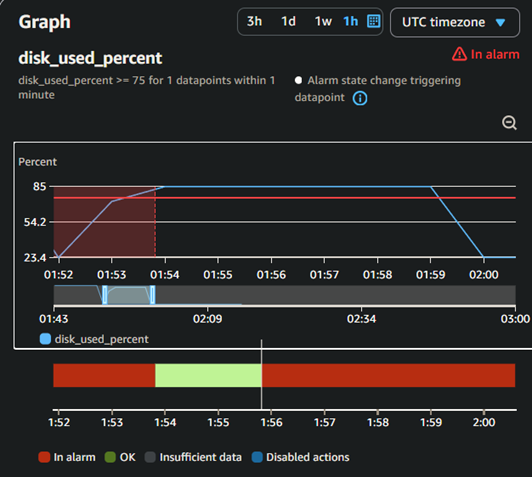
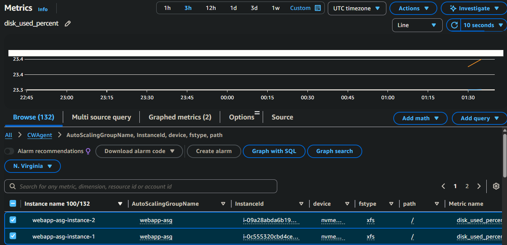
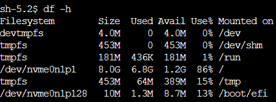
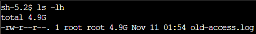
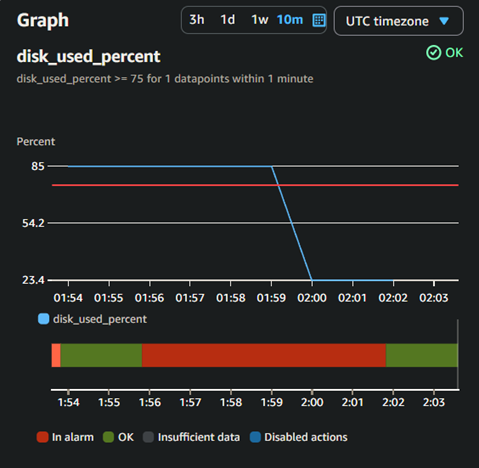

# Incident #04: Disk Space Alert

## Incident Summary
**Date:** 2025-11-10  
**Duration:** [Will fill in at end]  
**Severity:** High  
**Impact:** Single instance approaching disk capacity, risk of application failure  
**Root Cause:** 5 GB log file (/var/log/app/old-access.log) consuming space on the root volume due to simulated unmonitored log growth.

---

## Pre-Incident Setup

ASG auto-healing processes remain suspended from previous incidents.

**Monitoring configuration:**
- Disk usage alarm threshold: >= 85% (Maximum across ASG)
- CloudWatch Agent collecting disk metrics via CWAgent namespace
- Alarm uses Maximum statistic to detect if ANY instance has high disk usage

Suspended processes:
- HealthCheck
- ReplaceUnhealthy
- Terminate

**Reconfigure CloudWatch Agent disk monitoring**
Before this incident CloudWatch Agent was configured to monitor every mounted file system for disk usage:
```json
      "disk": {
        "measurement": ["used_percent"],
        "metrics_collection_interval": 60,
        "resources": ["*"]
      }
```
Which resulted in false alarms if any of the instance's drives had high usage. To make alarms and metrics more accurate, created a new launch template version with updated CloudWatch Agent config and changed the value to monitor only the root drive.
```json
      "disk": {
        "measurement": ["used_percent"],
        "metrics_collection_interval": 60,
        "resources": ["/"]
      }
```

---

## Timeline (in UTC)

``` 
01:54 - Wrote 5GB file into /var/log/app directory
01:56 - SNS email received for high disk usage alarm
01:57 - Opened CloudWatch metrics and checked individual instance disk usage percent
01:58 - SSM into i-0c555320cbd4cea49 
01:59 - Drill down into root drive using 
02:00 - File old-access.log found and removed
02:01 - Alarm recovered
02:05 - Continued monitoring dashboard, systems normal
```
---

## Detection
- CloudWatch alarm triggered at 01:54 UTC:
    - EC2-High-Disk-Usage: >= 75% disk_used_percent for 1 minute
- SNS email received
- Dashboard metrics also show high disk usage at ASG-level, requiring investigation



---

## Investigation Process
- CloudWatch Metrics → CWAgent → (AutoScalingGroupName, InstanceId, device, fstype, path) → check both active instances root.



**SSM into i-0c555320cbd4cea49 and check filesystem:**
```sh
df -h
```



**Identify large directories:**
```sh
sudo du -h -d1 / | sort -hr | head -10
sudo du -h -d1 /var | sort -hr | head -10
sudo du -h -d1 /var/log | sort -hr | head -10
```


**Find large file**
```sh
ls -lh # /var/log/app
```


### Root Cause Analysis
5 GB (/var/log/app/old-access.log) consuming space on the root volume due to simulated unmonitored log growth.

In a production environment this could represent:
- Unmonitored log growth requiring rotation
- Backup or temporary files written to root filesystem
- Log rotation failing to compress or purge old files

---

## Resolution

### Steps Taken 

```sh
# Check that no process is currently using file
sudo lsof /var/log/app/old-access.log

# Remove file
sudo rm -f /var/log/app/old-access.log

```

### Verification

```bash
# Verify filesystem usage normal  
df -h
```
Disk usage dropped to ~23%
Alarm state and dashboard metrics returned to normal after 2-3 minutes



---

## Post-Incident Actions
- Removed test directory /var/log/app
- Verified CloudWatch metrics normal
- Re-enabled ASG processes

---

## Lessons Learned

### What Worked Well
- CloudWatch disk alarm triggered accurately
- Followed step by step investigation to find problem file
- Simple commands (`df`, `du`, `ls`, `lsof`) quickly pinpointed root cause

### Areas For Improvement
- Could configure CloudWatch Agent to track disk space per mount for more granularity
- Implement periodic log rotation to avoid potential large files in the future

---

## Prevention Strategies
- Implement log rotation to compress and purge old logs
- Add cron script for disk usage reporting
- Create CloudWatch disk alarms for 80% (warning) and 90% (critical)
- Regularly monitor usage trends

---

## Technical Details

**Affected Instance:** i-0c555320cbd4cea49 
**File System:** /dev/nvme0n1p1 (root volume)  
**Commands used:**
```bash
df -h
sudo du -h -d1 / | sort -hr | head -20
sudo ls -lh /var/log/app
sudo lsof /var/log/app/old-access.log
sudo rm -f /var/log/app/old-access.log
```

---

## Metrics
- Time to detect: 2 minutes
- Time to identify root cause: 6 minutes
- Time to resolve: 1 minute
- Time to verify: 3 minutes
- Total incident duration: 12 minutes
