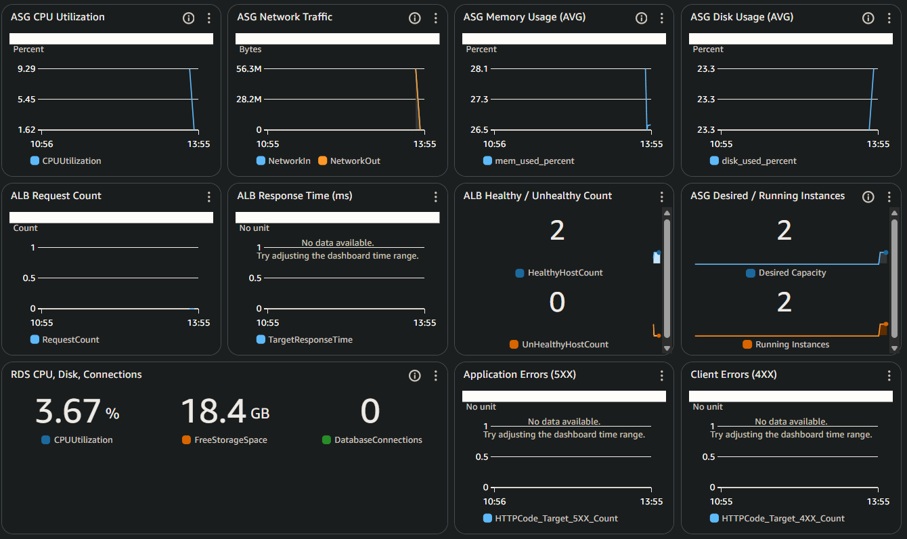
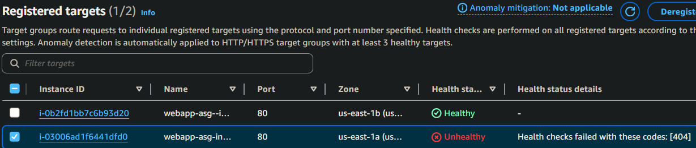
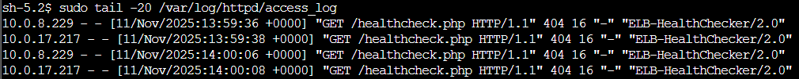
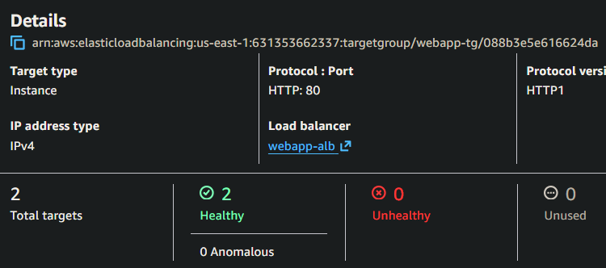

# Incident #05: ALB 502 Errors

## Incident Summary
**Date:** 2025-11-09  
**Duration:** 15 minutes
**Severity:** High (one target unhealty, 50% capacity reduction)
**Impact:** One ALB target became unhealthy, reducing available capacity. 
**Root Cause:** Health check endpoitn file was accidentally moved/deleted

---

## Pre-Incident Setup

- ASG: Desired capacity 2, auto-healing suspended
- Both instances healthy and serving traffic
- All CloudWatch metrics normal


---

## Timeline (in UTC)

```

01:57 - Simulated accidental file deletion by moving healthcheck.php to .bak 
01:58 - Dashboard showing 1 unhealthy instance
02:02 - CloudWatch alarm ASG-Single-Instance-Unhealthy triggers, SNS email received
02:03 - SSM into instance, check httpd status: active
02:04 - Access Apache error/access logs
02:05 - Found healthcheck file was renamed, corrected then verified with curl
02:07 - Target group and dashboard metrics showing healthy instances
02:09 - Alarm cleared
02:10 - Verified all systems normal
```


---

## Detection
- Noticed CloudWatch dashboard showing unhealthy target
- Target group health check for instance failed with 404



---

## Investigation Process

Connected to affected instance via SSM Session Manager:
```bash
# Verified Apache was running
sudo systemctl status httpd
# Active and running normally

# Confirmed Apache listening on port 80
sudo netstat -tlnp
# Result: Apache listening on correct port

# Tested health check endpoint locally
curl -I http://localhost/healthcheck.php
# 404 Not Found

# Checked Apache error log
sudo tail -20 /var/log/httpd/error_log
# [client 10.0.17.217:22740] AH01071: Got error 'Unable to open primary script: /var/www/html/hea

# Checked Apache access log
sudo tail -20 /var/log/httpd/access_log
# 10.0.17.217 - - [11/Nov/2025:15:14:11 +0000] "GET /healthcheck.php HTTP/1.1" 404 16 "-" "ELB-HealthChecker/2.0"
```


### Root Cause Analysis

Healthcheck.php.bak exists, healthcheck.php missing
Root cause: Health check file was moved/renamed

```bash
ls -la /var/www/html/
# -rw-r--r--. 1 apache apache 360 Nov 11 13:48 healthcheck.php.bak
# -rw-r--r--. 1 apache apache 473 Nov 11 13:48 index.php
```

---

## Resolution

### Fix Applied
```bash
# Restored the health check file
sudo mv /var/www/html/healthcheck.php.bak /var/www/html/healthcheck.php

# Verified file
ls -la /var/www/html/healthcheck.php
# -rw-r--r--. 1 apache apache 360 Nov 11 13:48 healthcheck.php
# -rw-r--r--. 1 apache apache 473 Nov 11 13:48 index.php

curl -I http://localhost/healthcheck.php
# HTTP/1.1 200 OK
```

### Verification steps
- `curl` returned 200 OK
- Target group health checks passed after 30-60 seconds
- Dashboard metrics returned to normal


---

## Post-Incident Actions
- Terminated and restarted instances to return to clean baseline state
- ASG auto-healing remains suspended for additional incident simulations

---

## Lessons Learned

### What Worked Well
- **Layered investigation approach:** ALB → Instance → Application layer
- **Target group health details:** Immediately showed 404 response
- **Apache logs:** Clearly indicated missing file

### Areas For Improvement
- Alarm took longer to respond, lower datapoints and shorten time period 
- Document critical application files that must exist
- Include health check endpoint verification in deployment checklists

---

## Technical Details


**Affected Instances:**  i-03006ad1f6441dfd0
**Commands used:**
```bash
# Service status
sudo systemctl status httpd

# Network verification  
sudo netstat -tlnp

# Local endpoint testing
curl -I http://localhost/healthcheck.php

# Log analysis
sudo tail -20 /var/log/httpd/error_log
sudo tail -20 /var/log/httpd/access_log

# File operations
ls -la /var/www/html/
sudo mv [source] [destination]
```

## Additional Notes

### PHP-FPM Resource Testing
After resolving the health check issue, I attempted to simulate PHP worker pool exhaustion by reducing the pool to 2 workers and generating concurrent load. The test showed that PHP handled the load without failures and was resilient enough to handle the simulation.

## Metrics
- Time to detect: 1 minute
- Time to identify root cause: 6 minutes
- Time to resolve: 1 minute
- Time to verify: 4 minutes
- Total incident duration: 12 minutes
