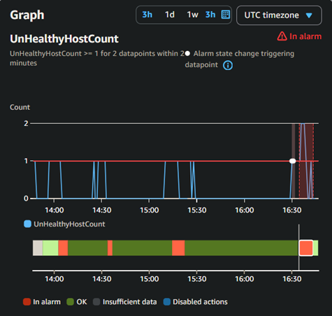
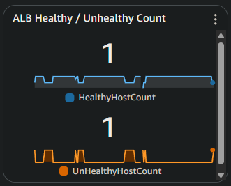
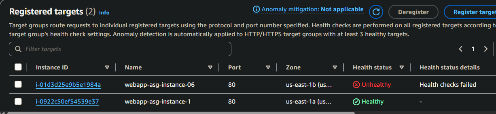
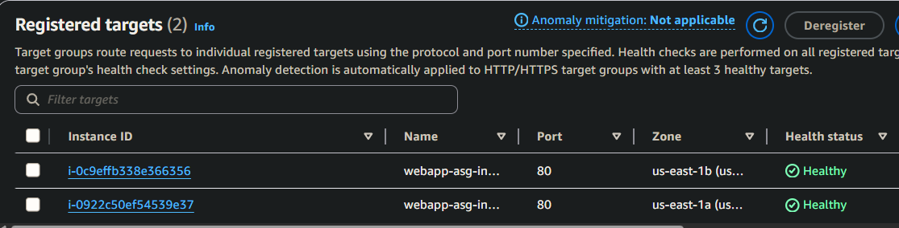

# Incident #6: ASG Launch Failure

## Incident Summary
**Date:** 2025-11-11  
**Duration:** ~15 minutes
**Severity:** High
**Impact:** Auto Scaling Group failed to successfully launch new instances due to user data error in launch template.
**Root Cause:** Typo in user data script (`httpdd` instead of `httpd`) causing bootstrap process to exit early, leaving the instance unconfigured.

---

## Pre-Incident Setup

ASG auto-healing processes were active for this scenario to observe automated recovery behavior.

**Monitoring configuration:**
- ASG CloudWatch alarms:
    - ASG-Single-Instance-Unhealthy
    - ASG-All-Instances-Unhealthy

- CloudWatch dashboard tracking:
    - GroupInServiceInstances
    - UnHealthyHostCount

- Launch template version included intentional syntax error.

---

## Timeline (UTC)

```
16:29 - Terminated healthy instance to trigger ASG replacement
16:32 - New instance launched, health checks failed
16:33 - Dashboard showing 1 healthy and 1 unhealthy instance
16:34 - CloudWatch alarm "ASG-Single-Instance-Unhealthy" triggered
16:35 - SSM into unhealthy instance; viewed cloud-init logs showing httpdd installation failure
16:36 - ASG automatically launched second instance (still broken template)
16:37 - Fixed launch template typo (“httpdd” → “httpd”)
16:39 - Terminated remaining unhealthy instances to force new launch
16:40 - Multiple instances unhealthy alarm triggered briefly
16:43 - New instances launched successfully and passed health checks
```

---

## Detection

- CloudWatch alarm: ASG-Single-Instance-Unhealthy



- Dashboard metric: HealthyHostCount dropped to 1



- ALB target group: one instance “unhealthy”



- ASG showing “launching replacement instance”
- Target group registered instance but health checks failed

---

## Investigation Process

**Checked ASG Activity History**
```
At 2025-11-11T16:35:40Z an instance was launched in response to an unhealthy instance needing to be replaced.
```

**Connected to Unhealthy Instance**
```bash
sudo cat /var/log/cloud-init-output.log
# No match for argument: httpdd
# Package wget-1.21.3-1.amzn2023.0.4.x86_64 is already installed.
# Error: Unable to find a match: httpdd
# Failed to start httpd.service: Unit httpd.service not found.
# Failed to enable unit: Unit file httpd.service does not exist.
```

**Verified Instance State**
- Instance status checks: PASSED
- Application status: FAILED (no Apache process)
- ALB health checks: 0/2 passed

**Root Cause Analysis:**

Typo in user data line:
```bash
yum install -y httpdd php php-mysqli mariadb105 wget nmap-ncat
```
The command failed and the script failed to install httpd and connect to RDS, leading to failed health checks.

- ASG cooldown and grace period slowed down detection and replacement
- Instance status checks at EC2 level passed, so failure was only visible at the ALB/application layer.
- Without CloudWatch Agent running on the unhealthy instance there were no instance metrics to correlate with an alarm.

---

## Resolution

**Steps Taken:**
1. Opened launch template and corrected user data typ
```bash
yum install -y httpd php php-mysqli mariadb105 wget nmap-ncat
```
2. Created new launch template version and updated ASG to use it.
3. Terminated all unhealthy instances to trigger fresh launches.

## Verification
- Target group 2/2 healthy
- Dashboard metrics stable
- CloudWatch alarms cleared



---

## Post-Incident Observations

- Cooldown settings (300 seconds) significantly delayed automatic replacement.
- CloudWatch Agent not sending metrics further complicated detection.

---

## Lessons Learned

### What Worked Well
- CloudWatch and ALB health checks effectively detected unhealthy instance.
- ASG automatically replaced unhealthy instances once cooldown expired.
- Cloud-init logs provided a clear root cause.

### Areas For Improvement
- Reduce ASG cooldown and grace period for faster failure recovery.
- Add verification step in user data to log success or failure of key services.
- Test new launch template versions in isolated sandbox before production.

---

## Prevention Strategies
- Implement CI/CD-style launch template validation before deployment.
- Adding structured logging (tee -a /var/log/bootstrap.log) would make failures much clearer in future.
- Configure CloudWatch Agent to report bootstrap status and create alarm to alert if new instances dont report.
```bash
# == In User Data == 
# Add to send bootstrap success metric 
aws cloudwatch put-metric-data \
  --namespace "InstanceBootstrap" \
  --metric-name "UserDataSuccess" \
  --value 1 \
  --region us-east-1
if [ $? -eq 0 ]; then
  echo "$(date): Bootstrap success metric sent to CloudWatch."
else
  echo "$(date): WARNING - Failed to send CloudWatch metric."
fi

# == In Terminal == 
# Add CloudWatch Alarm to track bootstrap failure
aws cloudwatch put-metric-alarm \
  --alarm-name "ASG-Bootstrap-Failure" \
  --alarm-description "Triggers when no UserDataSuccess metric is received within 10 minutes for the ASG" \
  --namespace "InstanceBootstrap" \
  --metric-name "UserDataSuccess" \
  --statistic "Sum" \
  --period 600 \
  --evaluation-periods 1 \
  --threshold 0 \
  --comparison-operator "LessThanOrEqualToThreshold" \
  --treat-missing-data breaching \
  --alarm-actions arn:aws:sns:us-east-1:631353662337:webapp-alerts
```
- Tune cooldown and grace period depending on bootstrap time
- Test new launch template on single EC2 instance before pushing to ASG

---

## Technical Details

**ASG:** webapp-asg
**Launch Template Versions:**
- v3 (broken, httpdd)
- v4 (fixed, httpd) 

**Affected Instances:**  i-01d3d25e9b5e1984a, i-032093a8ece860591

**Commands used:**
```bash
sudo cat /var/log/cloud-init-output.log
sudo systemctl status amazon-cloudwatch-agent
aws autoscaling start-instance-refresh --auto-scaling-group-name webapp-asg
```

---

## Metrics
- Time to detect: 3 minutes
- Time to identify root cause: 6 minutes
- Time to resolve: 5 minutes 
- Time to verify: 2 minutes
- Total incident duration: ~15 minutes